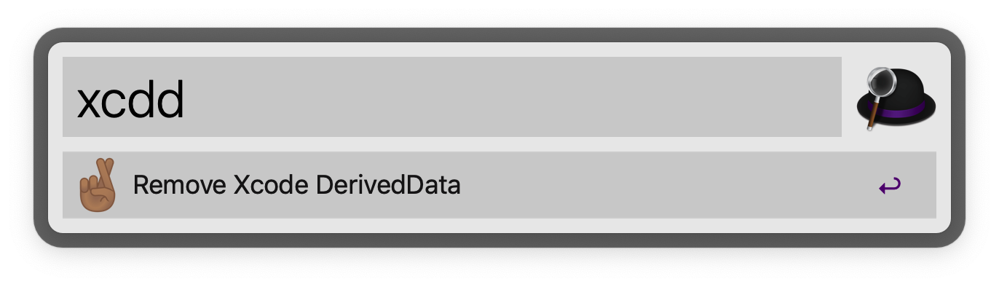

# xcdd_workflow
a simple xcdd workflow for Alfred2

## Download

Dowload workflow from [XcddWorkflow](https://github.com/ChopinChao/xcdd_workflow/releases)

## Features

Remove Xcode DeriveData for path '~/Library/Developer/Xcode/DerivedData/*'

It's easy to use.

